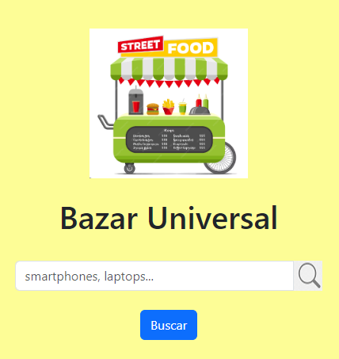

## **BazarUniversal4.0 - FrontEnd**

En esta aplicación web los usuarios podrán buscar el nombre del producto, se mostrará una lista de productos como resultado y podrán hacer clic en cada uno para ver el detalle.

**Tecnologías usadas**

- **JavaScript**
- **React JS**
- **Redux-Toolkit**
- **Bootstrap**
- **React-Bootstrap**
